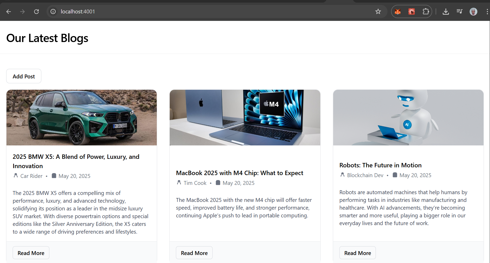
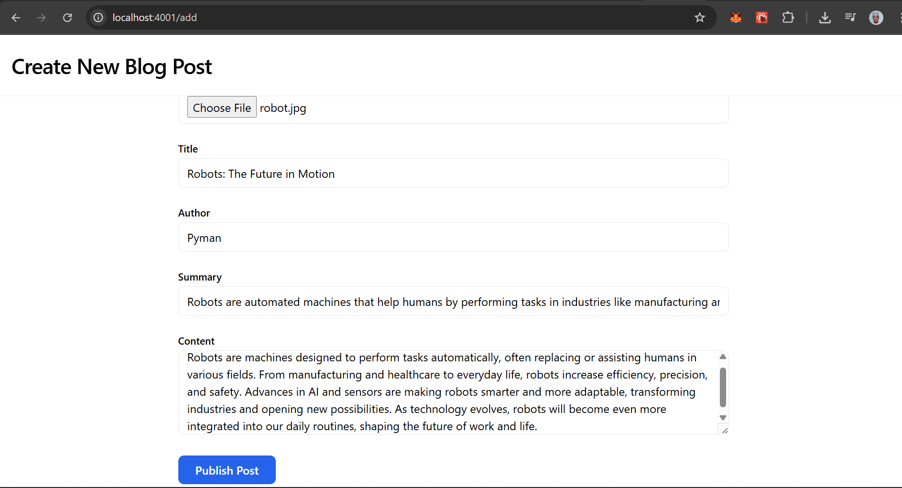
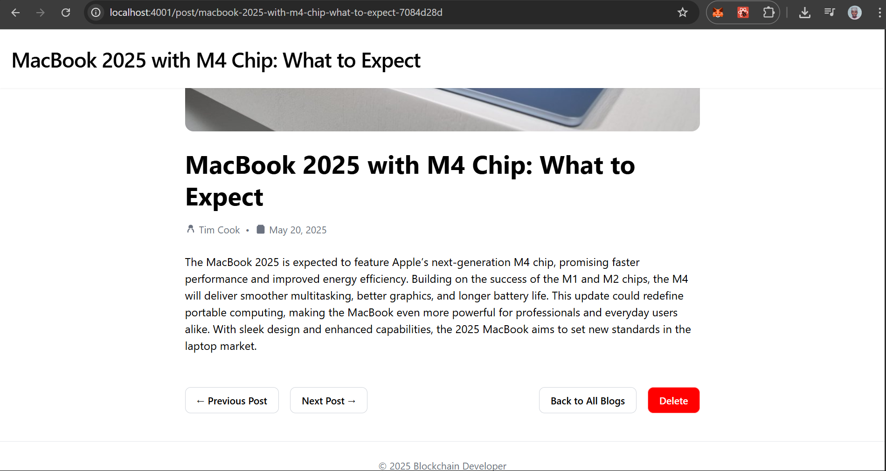

# Blog-React is my first project with the React framework!

Home page:

Creating a new blog post:

View a blog post:

___
## How to clone and run on your PC
### Cloning

To clone, run `git clone https://github.com/m-sabonkudi/Blog-ReactFlask.git`

___
### Running on PC

First, go into the project directory `cd Blog-ReactFlask`

___
#### Set up Flask
Create a new virtual environment: `cd flask` -> `python -m venv venv` (windows) or `python3 -m venv venv` (mac)

You should now have a folder named venv in your flask directory containing the virtual environment.

Activate the just-created virtual environment: `venv\Scripts\activate` (windows) or `source venv/bin/activate` (mac)

Install required python libraries: `pip install -r requirements.txt` (windows) or `pip3 install -r requirements.txt` (mac)

___
#### Set up React
Install react dependencies: `cd react` -> `npm install`

___
#### Run Flask
`python main.py` (windows) or `python3 main.py` (mac)

___
#### Run React
`npm run dev`

Now you can go to this link in your browser: 🟢 [http://localhost:4001](http://localhost:4001)